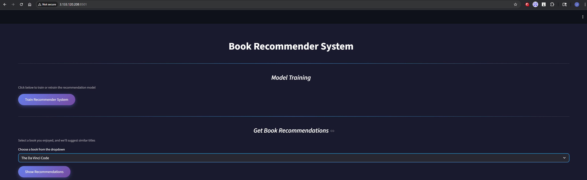
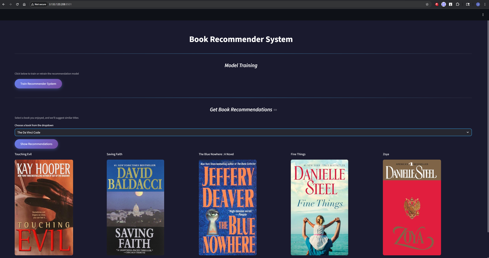

# Book Recommender System

A collaborative filtering-based book recommendation system built with Python, Streamlit, and KNN machine learning algorithm.


---

## Live Demo

**Application URL**: "http://3.133.120.208:8501"

---


## Screenshots

### Home Page


### Book Recommendations



## Project Overview

This project implements an end-to-end machine learning pipeline for book recommendations using collaborative filtering. The system analyzes user rating patterns to suggest similar books based on what other readers enjoyed.

### Key Features
- **Automated Data Pipeline**: Download, validate, transform, train, and evaluate in one flow
- **Collaborative Filtering**: Uses KNN algorithm to find similar books
- **Model Evaluation**: Recall @10 metric for performance tracking
- **Web Interface**: User-friendly Streamlit app for recommendations
- **Production-Ready**: Comprehensive logging, error handling, and configuration management
- **Dockerized**: Easy deployment with Docker containers

---

## Architecture

### Pipeline Stages
```
Stage 0: Data Ingestion
    ↓
Stage 1: Data Validation
    ↓
Stage 2: Data Transformation
    ↓
Stage 3: Model Training
    ↓
Stage 4: Model Evaluation
    ↓
Web Application (Streamlit)
```

### Project Structure
```
Book-recommender-system-collab-filtering/
├── artifacts/                      # Generated artifacts
│   └── data_ingestion/
│       ├── raw_data/              # Downloaded CSV files
│       ├── clean_data/            # Cleaned datasets
│       ├── serialized_objects/    # Pickled objects
│       ├── trained_model/         # Trained KNN model
│       └── evaluation_output/     # Evaluation metrics
├── books_recommender/             # Main package
│   ├── components/                # Pipeline stages
│   │   ├── stage_00_data_ingestion.py
│   │   ├── stage_01_data_validation.py
│   │   ├── stage_02_data_transformation.py
│   │   ├── stage_03_model_trainer.py
│   │   └── stage_04_model_evaluation.py
│   ├── config/
│   │   └── configuration.py       # Configuration manager
│   ├── constant/
│   │   └── __init__.py           # Constants
│   ├── entity/
│   │   └── config_entity.py      # Configuration dataclasses
│   ├── exception/
│   │   └── exception_handler.py  # Custom exceptions
│   ├── logger/
│   │   └── log.py                # Logging configuration
│   ├── pipeline/
│   │   └── training_pipeline.py  # Pipeline orchestration
│   └── utils/
│       └── util.py               # Utility functions
├── config/
│   └── config.yaml               # Configuration file
├── logs/                          # Log files
├── app.py                         # Streamlit web application
├── main.py                        # Training pipeline entry point
├── Dockerfile                     # Docker configuration
├── requirements.txt               # Python dependencies
└── README.md                      # This file
```

---

## Model Performance

### Baseline Metrics

**Recall @10: 4.09%**

**Evaluation Methodology**
- Train/test split: 50/50 per user
- Relevant threshold: Rating >= 8
- Aggregated recommendations from all highly-rated training books
- Evaluated on 693 users

**Dataset Statistics**
- Training samples: 29,697
- Test samples: 30,153
- Total users: 888
- Total books: 742

### Performance Details

**Algorithm**: K-Nearest Neighbors (Brute-force)
- Similarity metric: Distance-based (Euclidean via sparse matrix)
- Neighbors considered: 11 (returns top 10 recommendations)
- Recommendation aggregation: Frequency-based voting

### Challenges and Limitations

1. **Sparse Data Matrix**
   - Coverage: 9% (59,850 ratings / 658,896 possible)
   - Limited user-book interactions

2. **Strict Data Filtering**
   - Books: 50+ ratings required
   - Users: 200+ ratings required
   - 95% of original data filtered out

3. **Dataset Size**
   - Original: 1.1M ratings
   - After filtering: 59,850 ratings

### Future Improvements

**Planned Enhancements**
- Implement matrix factorization (SVD/ALS)
- Relax filtering criteria to retain more data
- Hybrid content-collaborative approach
- Expected improvement: 10-15% Recall @10

**Additional Metrics**
- Precision @10
- Mean Average Precision (MAP)
- Normalized Discounted Cumulative Gain (NDCG)

---

## Local Setup

### Prerequisites
- Python 3.10 or higher
- pip (Python package manager)
- Git

### Installation Steps

1. **Clone the repository**
```bash
git clone https://github.com/Jimster397/Book-recommender-system-collab-filtering.git
cd Book-recommender-system-collab-filtering
```

2. **Create virtual environment**
```bash
python -m venv venv

# On Windows
venv\Scripts\activate

# On Mac/Linux
source venv/bin/activate
```

3. **Install dependencies**
```bash
pip install -r requirements.txt
```

4. **Train the model**
```bash
python main.py
```

This will run all pipeline stages:
- Stage 0: Data Ingestion
- Stage 1: Data Validation
- Stage 2: Data Transformation
- Stage 3: Model Training
- Stage 4: Model Evaluation

Evaluation results saved to: `artifacts/data_ingestion/evaluation_output/evaluation_metrics.json`

5. **Run the web application**
```bash
streamlit run app.py
```

The app will open in your browser at `http://localhost:8501`

---

## Docker Deployment

### Build Docker Image
```bash
docker build -t book-recommender .
```

### Run Docker Container
```bash
docker run -p 8501:8501 book-recommender
```

Access the app at `http://localhost:8501`

---

## AWS EC2 Deployment

### Step 1: Launch EC2 Instance

1. **Log in to AWS Console**
   - Go to EC2 Dashboard
   - Click "Launch Instance"

2. **Configure Instance**
   - **Name**: `book-recommender-server`
   - **AMI**: Ubuntu Server 22.04 LTS (Free tier eligible)
   - **Instance Type**: t2.medium (recommended) or t2.small (minimum)
   - **Key Pair**: Create new or use existing
   - **Network Settings**:
     - Allow SSH (port 22) from your IP
     - Allow Custom TCP (port 8501) from anywhere (0.0.0.0/0)
   - **Storage**: 20 GB (minimum)

3. **Launch Instance**

### Step 2: Connect to EC2
```bash
# SSH into your instance
ssh -i "your-key.pem" ubuntu@your-ec2-public-ip

# Example:
# ssh -i "book-recommender.pem" ubuntu@54.123.456.789
```

### Step 3: Install Docker on EC2
```bash
# Update packages
sudo apt-get update

# Install Docker
sudo apt-get install -y docker.io

# Start Docker service
sudo systemctl start docker
sudo systemctl enable docker

# Add user to docker group
sudo usermod -aG docker ubuntu

# Log out and back in for group changes to take effect
exit
# SSH back in
```

### Step 4: Install Git
```bash
sudo apt-get install -y git
```

### Step 5: Clone and Deploy
```bash
# Clone repository
git clone https://github.com/Jimster397/Book-recommender-system-collab-filtering.git

# Navigate to project
cd Book-recommender-system-collab-filtering

# Build Docker image
docker build -t book-recommender .

# Run Docker container
docker run -d -p 8501:8501 --name book-app book-recommender
```

### Step 6: Access Your App

Open your browser and go to:
```
http://your-ec2-public-ip:8501
```

Example: `http://54.123.456.789:8501`

### Step 7: Useful Docker Commands
```bash
# View running containers
docker ps

# View logs
docker logs book-app

# Stop container
docker stop book-app

# Start container
docker start book-app

# Remove container
docker rm book-app

# Rebuild and restart
docker stop book-app
docker rm book-app
docker build -t book-recommender .
docker run -d -p 8501:8501 --name book-app book-recommender
```

---

## Configuration

All configuration is managed through `config/config.yaml`:
```yaml
data_ingestion_config:
  source_urls:
    books: "URL_TO_BOOKS_CSV"
    ratings: "URL_TO_RATINGS_CSV"
    users: "URL_TO_USERS_CSV"
  raw_data_dir: artifacts/data_ingestion/raw_data

# ... other configurations
```

---

## Dataset

- **Source**: Book-Crossing Dataset
- **Books**: 271,360 entries
- **Ratings**: 1,149,780 entries
- **Users**: 278,858 entries

After filtering:
- **Final Books**: 742 (with 50+ ratings)
- **Active Users**: 888 (with 200+ ratings)
- **Quality Ratings**: 59,850

---

## Technology Stack

- **Language**: Python 3.11
- **Web Framework**: Streamlit
- **ML Algorithm**: K-Nearest Neighbors (KNN)
- **Data Processing**: Pandas, NumPy
- **ML Libraries**: Scikit-learn, SciPy
- **Deployment**: Docker, AWS EC2
- **Evaluation**: Custom Recall @10 metric

---

## How It Works

1. **User selects a book** from the dropdown
2. **System finds the book** in the pivot table (742 books × 888 users)
3. **KNN algorithm** finds 5 most similar books based on rating patterns
4. **Results displayed** with book titles and cover images

---

## Logs

All operations are logged in the `logs/` directory with timestamps:
```
logs/log_2026-02-06-21-55-34.log
```

---

## Troubleshooting

### EC2 Cannot Connect
- Check Security Group allows port 8501
- Verify EC2 instance is running
- Check Docker container is running: `docker ps`

### App Not Loading
```bash
# Check container logs
docker logs book-app

# Restart container
docker restart book-app
```

### Memory Issues
- Use t2.medium or larger instance type
- Monitor with: `docker stats book-app`

---

## Contributing

Contributions are welcome! Please feel free to submit a Pull Request.

---

## License

This project is licensed under the MIT License.

---

## Author

**James Schmidt**
- GitHub: [@Jimster397](https://github.com/Jimster397)

---

## Acknowledgments

- Book-Crossing Dataset
- Streamlit Community
- scikit-learn Documentation

---

## Contact

For questions or feedback, please open an issue on GitHub.

---

**Built with Python and Streamlit**